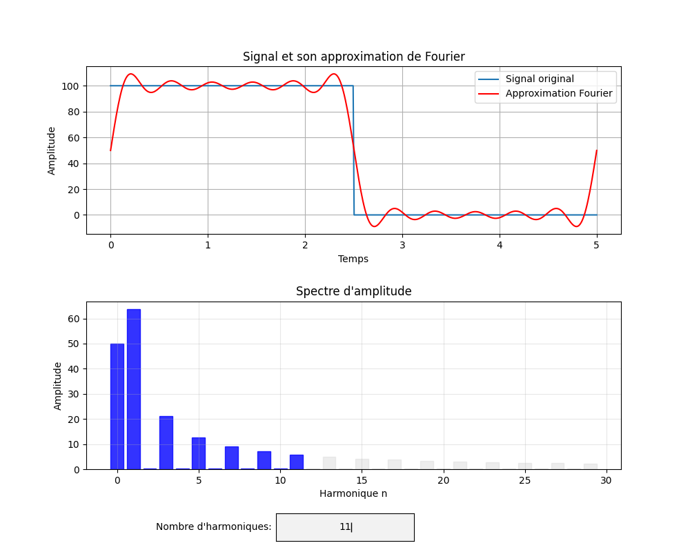

# FourierFun

Visualisation de la transformée de Fourier avec son spectre et l'approximation correspondante.

## Prérequis

Python 3 avec numpy et matplotlib

## Lancer le code

 - Copier le répertoire avec tous les fichiers dans votre machine
 - Ouvrir le dossier dans l'explorateur de fichiers
 - Effectuer un MAJ + Clic droit dans la fenêtre => Ouvrir la fenêtre Powershell ici
 - Taper la commande suivante dans le shell:\
 `python3 .\fourier.py creneau`\
 (Si vous obtenez une erreur de type no module named ..., installez numpy et matplotlib avec:)\
`python3 -m pip install numpy, matplotlib`
 - Une fenêtre s'ouvre dans laquelle vous pouvez choisir le nombre d'harmoniques de l'approximation de Fourier. Il est possible de monter jusqu'à n=100 mais le spectre en amplitude ne fait figurer que les 30 premières.

## Autres signaux

Plusieurs "waveforms" sont implémentées ici. Par exemple :\
`python3 .\fourier.py triangle`\
vous affichera la fenêtre pour un signal triangle. Vous pouvez jouer avec les différentes mots-clés:\
 - `triangle`
 - `creneau`
 - `scie`
 - `cercle`
 - `pic`

Le plus intéressant est le signal pic, car son spectre en amplitude n'est pas monotone

## Ajouter ses propres signaux

Vous pouvez ajouter vos propres signaux en définissant d'abord sur papier une fonction de [0, T] de votre choix.
Créez ensuite un nouveau fichier "fonction.py" dans laquelle vous définirez votre signal
(Basez-vous sur ce qui est déjà défini dans les scripts existants)
Ajoutez ensuite le mot-clé de ligne de commande dans la fonction match du fichier fourier.py
